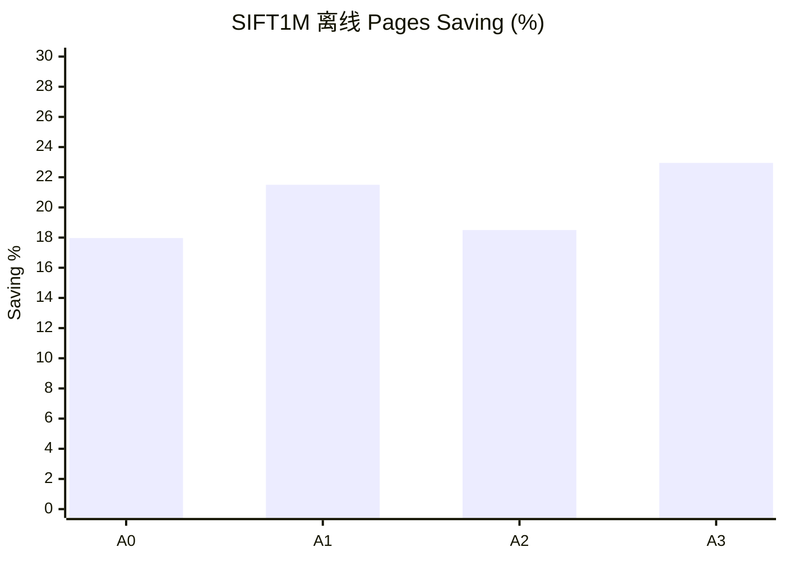
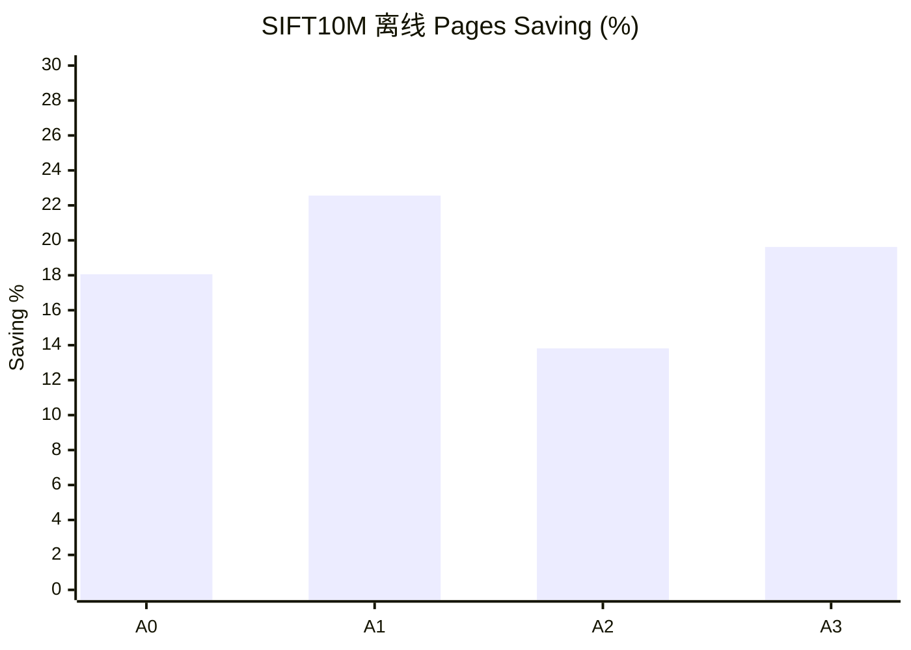
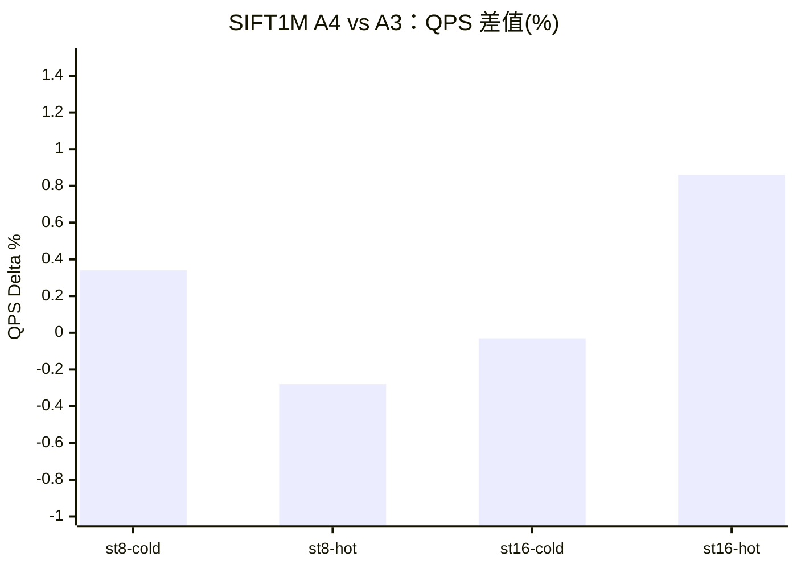
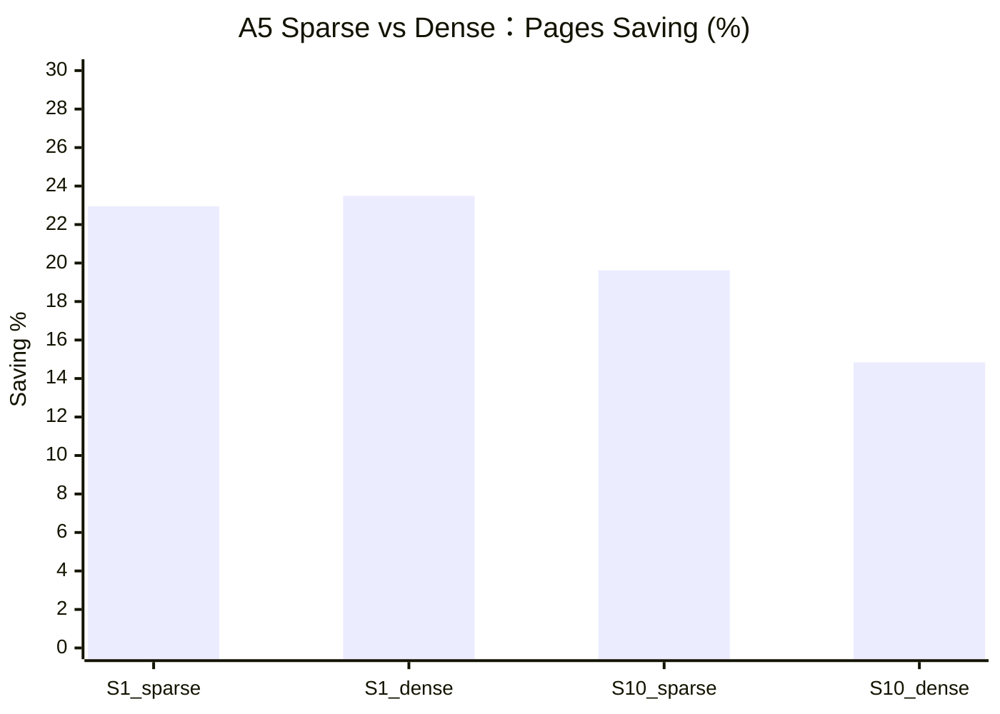

# SPANN Learned Policy 预算粒度优化方案

日期：2026-05-05

## 1. 目标

当前 learned policy 的每查询 posting 预算粒度较粗，在线候选大致为：

```text
B ∈ {32, 40, 48, 64}
```

当前在线决策逻辑：

```text
if P(safe | B=32) >= threshold: B = 32
elif P(safe | B=40) >= threshold: B = 40
elif P(safe | B=48) >= threshold: B = 48
else: B = 64
```

当前结果：

| 数据集 | 当前 Pages Saving | Oracle Saving | Oracle 利用率 |
|---|---:|---:|---:|
| SIFT1M | 17.3% | 50.8% | 34.1% |
| SIFT10M | 18.2% | 42.2% | 43.1% |

优化目标：

```text
SIFT1M:  Pages Saving >= 24%~26%
SIFT10M: Pages Saving >= 23%~25%
Recall@10 下降 <= 0.002
低召回查询数量不增加
QPS 相比当前 learned 提升 >= 3%~5%
```

## 2. 假设

### H1：当前预算粒度过粗

当前只能选 `32/40/48/64`，大量查询回退到 `64`，说明模型对 `48` 的安全性判断不够有信心。

当前在线分布：

| 数据集 | B<=32 | B<=40 | B<=48 | 回退到约 64 |
|---|---:|---:|---:|---:|
| SIFT1M | 21.3% | 12.6% | 15.1% | 51.1% |
| SIFT10M | 21.8% | 11.2% | 21.0% | 46.0% |

Oracle 显示真正需要 `B=64` 的查询远少于当前回退比例：

| 数据集 | Oracle B=64 |
|---|---:|
| SIFT1M | 11.2% |
| SIFT10M | 18.2% |

推论：增加中间预算（尤其 `B=56`）应能减少不必要回退。

### H2：`B=56` 是低风险改进点

`56` 与 `64` 距离近，误判代价显著低于 `32/40/48`，可吸收当前回退到 `64` 的不确定查询，在较小召回代价下增加 saving。

### H3：超低预算（16/24）有潜力，但必须更强保护

Oracle 显示一批简单查询可用更小预算，尤其 SIFT1M。引入 `16/24` 可进一步逼近 Oracle，但误判代价高，必须采用更保守阈值或额外防护特征。

### H4：分预算阈值优于单全局阈值

不同预算误判代价不同：

```text
错用 B=32：高召回风险
错用 B=48/56：风险相对更低
```

因此应对小预算使用更严格阈值，对大预算使用更宽松阈值。

## 3. 成功标准

### 3.1 主要成功标准

```text
Recall@10 下降 <= 0.002
低召回查询数量不增加
Pages Saving 比当前 learned 至少再提升 5 个百分点
QPS 比当前 learned 提升 >= 3%
```

### 3.2 强成功标准

```text
SIFT1M Pages Saving >= 26%
SIFT10M Pages Saving >= 25%
QPS 提升 >= 5%
Recall@10 下降 <= 0.0015
P99 延迟增幅 <= 3%
```

### 3.3 Oracle 利用率标准

```text
SIFT1M 达到 Oracle Saving 的 >= 50%
SIFT10M 达到 Oracle Saving 的 >= 55%
```

换算阈值：

```text
SIFT1M: 50.8% * 0.50 = 25.4%
SIFT10M: 42.2% * 0.55 = 23.2%
```

## 4. 独立失败信号

这些信号不是“没达到成功标准”的简单反面，而是独立风险。

### F1：预算塌缩

例如 `B=32` 占比 > 45%，策略退化为全局降预算，不再是 query-aware。

### F2：尾部召回退化

平均召回尚可，但难查询恶化：

```text
recall < 0.7 的查询数增加
recall < 0.5 的查询数增加
```

### F3：难查询被低配

Oracle 需要 `B=64` 的查询被频繁分配到 `B<=48`。

### F4：离线-在线不一致

离线显示高 saving/低风险，在线却没有对应 pages/QPS 改善。

### F5：QPS 与 pages 解耦

pages 降了但 QPS 不升反降，可能被模型开销、分支、调度、缓存行为抵消。

### F6：校准失真

模型给出高置信（如 `P(safe)>=0.95`）时实际安全率明显低于 95%。

### F7：数据集特异过拟合

SIFT1M 有效但 SIFT10M 退化（或反之）。

### F8：阈值不稳定

阈值微调 `0.01` 就引起预算分布大跳变。

### F9：`B=56` 空转

`B=56` 分配占比高，但 pages/QPS 改善很小，复杂度上升却无收益。

## 5. 消融计划

### A0：当前 learned 基线

```text
预算：{32,40,48,64}
单阈值
SIFT1M: threshold=0.95
SIFT10M: threshold=0.85
```

预期：SIFT1M saving 约 17.3%，SIFT10M saving 约 18.2%。

### A1：仅增加 B=56

```text
预算：{32,40,48,56,64}
单阈值
新增 risk_model_b56
```

预期：saving 增加 2~4 个百分点，回退 `64` 比例下降。

### A2：不加新预算，仅做分预算阈值

```text
预算：{32,40,48,64}
阈值：分预算
```

建议初值：

```text
SIFT1M: t32=0.98, t40=0.96, t48=0.92
SIFT10M: t32=0.95, t40=0.90, t48=0.85
```

### A3：B=56 + 分预算阈值

```text
预算：{32,40,48,56,64}
阈值：分预算
```

建议初值：

```text
SIFT1M: t32=0.98, t40=0.96, t48=0.93, t56=0.88
SIFT10M: t32=0.95, t40=0.92, t48=0.88, t56=0.82
```

### A4：增加超低预算

```text
预算：{16,24,32,40,48,56,64}
阈值：分预算且更保守
新增 risk_model_b16 / risk_model_b24
```

### A5：Sparse vs Dense

```text
Sparse: {32,40,48,56,64}
Dense:  {16,24,32,40,48,56,64}
```

### A6：单模型替代（多分类/回归）

```text
多分类：直接预测 min_B 类别
回归：预测连续预算再映射到离散预算
```

### A7：Page-aware 策略研究

核心假设：posting 数不等于真实 I/O 代价，page/read bytes 才是关键成本。

## 6. 推荐执行顺序

### Step 1：离线回放

先不改 C++，完成：

```text
训练 risk_model_b56
分预算阈值 sweep
离线比较 A0/A1/A2/A3
输出分布、saving、miss、校准
```

### Step 2：在线 A3

实现并验证：

```text
预算 {32,40,48,56}
分预算阈值
SIFT1M/SIFT10M: st=8, nt=16, ir=64
每次测试前清缓存
```

### Step 3：A3 通过后再做在线 A4

```text
增加 B=16/B=24
采用强保守阈值
```

### Step 4：page-aware 离线研究

仅在 A3/A4 与 Oracle 仍有明显差距时推进。

## 7. 首推实现路径

首选 A3：

```text
预算：{32,40,48,56,64}
分预算阈值
```

这是最低风险路径，因为 `B=56` 在 `64` 之前提供了温和缓冲。

## 8. 执行状态（2026-05-05）

执行顺序按计划进行：

1. Step 1 离线回放
2. Step 2 在线 A3（严格缓存）

### 8.1 产物

离线：

- `results/adaptive_budget/budget_granularity_plan_20260505/offline_ablation_summary.csv`
- `results/adaptive_budget/budget_granularity_plan_20260505/offline_ablation_summary.md`
- `results/adaptive_budget/budget_granularity_plan_20260505/sift1m_meta.json`
- `results/adaptive_budget/budget_granularity_plan_20260505/sift10m_meta.json`

在线：

- `results/adaptive_budget/budget_granularity_plan_20260505/online/sift1m_A0.csv`
- `results/adaptive_budget/budget_granularity_plan_20260505/online/sift1m_A3.csv`
- `results/adaptive_budget/budget_granularity_plan_20260505/online/sift10m_A0.csv`
- `results/adaptive_budget/budget_granularity_plan_20260505/online/sift10m_A3.csv`
- `results/adaptive_budget/budget_granularity_plan_20260505/online_summary.csv`
- `results/adaptive_budget/budget_granularity_plan_20260505/online_delta_vs_a0.csv`
- `results/adaptive_budget/budget_granularity_plan_20260505/execution_report.md`

补齐输入：

- `results/adaptive_budget/sift1m_ir64_retrain/budget_56.csv`
- `results/adaptive_budget/sift10m_ir64_retrain/budget_56.csv`

### 8.2 离线 A0/A1/A2/A3 结果快照（test split）

SIFT1M：

- A0 saving: `17.97%`
- A1 saving: `21.50%`
- A2 saving: `18.50%`
- A3 saving: `22.95%`
- A3 recall delta vs B64: `-0.00670`
- A3 miss: `5.90%`
- A3 oracle 利用率: `44.29%`

SIFT10M：

- A0 saving: `18.06%`
- A1 saving: `22.56%`
- A2 saving: `13.82%`
- A3 saving: `19.62%`
- A3 recall delta vs B64: `-0.01025`
- A3 miss: `9.60%`
- A3 oracle 利用率: `45.21%`

解释：

- `B=56` 能显著降低回退 `64`。
- 当前分预算阈值在 SIFT10M（以及部分 SIFT1M）偏激进，带来可观召回回退。

### 8.3 在线 A0 vs A3（严格缓存，st=8 nt=16 ir=64）

SIFT1M：

- A0 QPS: `7057`
- A3 QPS: `7474`（`+5.9%`）
- A0 recall@10: `0.97749`
- A3 recall@10: `0.97630`（delta `-0.00119`）
- pages/query：A3 相对 A0 下降 `5.93%`

SIFT10M：

- A0 QPS: `6636`
- A3 QPS: `6752`（`+1.8%`）
- A0 recall@10: `0.947214`
- A3 recall@10: `0.946483`（delta `-0.000730`）
- pages/query：A3 相对 A0 下降 `1.64%`

### 8.4 目标达成检查

- `Recall@10 delta <= 0.002`：在线 A3 对 A0 双数据集通过。
- `Pages Saving 比当前 learned +5pp`：SIFT1M 接近通过（`+4.98pp`），SIFT10M 未通过（`+1.56pp`）。
- `QPS +>=3%`：SIFT1M 通过（`+5.9%`），SIFT10M 未通过（`+1.8%`）。
- `低召回查询不增加`：SIFT10M 未完全满足。

结论：

- A3 在 SIFT1M 路径有效。
- SIFT10M 需继续阈值再标定。

## 9. A4 受控离线预演（仅 SIFT1M）

执行内容：

- 流量：`test split`（`2000` queries）
- 补齐：`budget_24.csv`
- 训练：`B={16,24,32,40,48,56}`
- 输出目录：`results/adaptive_budget/budget_granularity_plan_20260505/a4_preview_sift1m`

训练集 safe rate：

- `B16: 43.5%`
- `B24: 59.8%`
- `B32: 72.2%`
- `B40: 81.6%`
- `B48: 88.9%`
- `B56: 95.1%`

策略阈值：

- `A4_cons_v1`: `t16=0.998, t24=0.995, t32=0.985, t40=0.970, t48=0.945, t56=0.900`
- `A4_cons_v2`: `t16=0.997, t24=0.993, t32=0.982, t40=0.965, t48=0.938, t56=0.895`
- `A4_cons_v3`: `t16=0.996, t24=0.990, t32=0.980, t40=0.960, t48=0.930, t56=0.890`

结果（相对 B64）：

- `A3_ref`: saving `22.95%`, recall delta `-0.00670`, miss `5.90%`
- `A4_cons_v1`: saving `21.68%`, recall delta `-0.00595`, miss `5.30%`
- `A4_cons_v2`: saving `22.59%`, recall delta `-0.00630`, miss `5.55%`
- `A4_cons_v3`: saving `23.49%`, recall delta `-0.00660`, miss `5.80%`

观察：

- `B16/B24` 已被小比例启用（约 `3.6%~6.0%`），未出现集中失误。
- `low_recall<0.7` 与 `A3_ref` 持平。
- 该预演中 `B16/B24` 导致 miss 的计数为 0。

## 10. SIFT1M 在线继续验证（A4）

在线严格缓存测试：

- `A3_ref`
- `A4_cons_v1`
- `A4_cons_v2`
- `A4_cons_v3`

输出目录：`results/adaptive_budget/budget_granularity_plan_20260505/online_sift1m_a4`

单次结果：

- `A3_ref`: QPS `7485`, Recall@10 `0.976300`
- `A4_cons_v1`: QPS `7326`, Recall@10 `0.976720`
- `A4_cons_v2`: QPS `7358`, Recall@10 `0.976540`
- `A4_cons_v3`: QPS `7468`, Recall@10 `0.976380`

解释：

- `A4_cons_v1/v2` 虽有少量召回改善，但 QPS 明显下降。
- `A4_cons_v3` 与 A3 在 QPS 接近，召回略好。

5 次交替复现（A3 vs A4_v3）：

- QPS：`+0.12%`
- Recall@10：`+0.000088`
- pages/query：`-0.49%`
- postings/query：`-0.78%`
- `low<0.7`、`low<0.5`：无变化

结论：

- `A4_cons_v3` 是 SIFT1M 中最优 A4 候选。
- 但属于小幅增益，不是跃迁式提升。

## 11. SIFT1M 收口验证（st=8/16，冷/热缓存）

扩展验证：

- `st=8,16`
- `cold/hot`
- 每条件 5 次重复
- 对比 `A3_ref` vs `A4_cons_v3`

输出：

- `results/adaptive_budget/budget_granularity_plan_20260505/online_sift1m_finalize/finalize_report.md`
- `results/adaptive_budget/budget_granularity_plan_20260505/online_sift1m_finalize/delta_a4_vs_a3_by_condition.csv`

条件差值（A4 - A3）：

- `st=8,cold`：QPS `+0.34%`，Recall `+0.000078`，pages/query `-0.82%`
- `st=8,hot`：QPS `-0.28%`，Recall `+0.000080`，pages/query `-0.71%`
- `st=16,cold`：QPS `-0.03%`，Recall `+0.000104`，pages/query `+0.14%`（略差）
- `st=16,hot`：QPS `+0.86%`，Recall `+0.000080`，pages/query `-0.62%`

尾部鲁棒性：

- `low recall <0.7`：全条件不变
- `low recall <0.5`：全条件不变

SIFT1M 决策：

- `A4_cons_v3` 安全、基本无召回尾部退化。
- 收益小且受条件影响。
- 默认可保守用 `A3_ref`，也可探索性启用 `A4_cons_v3` 并保留回滚。

## 12. 剩余任务执行（A5/A6/A7）

已完成双数据集离线执行。

输出：

- `results/adaptive_budget/budget_granularity_plan_20260505/remaining_ablation/remaining_ablation_summary.csv`
- `results/adaptive_budget/budget_granularity_plan_20260505/remaining_ablation/remaining_ablation_report.md`

### 12.1 A5（Sparse vs Dense）

SIFT1M：

- `A5_sparse`: saving `22.95%`, recall delta `-0.00670`
- `A5_dense`: saving `23.49%`, recall delta `-0.00660`

SIFT10M：

- `A5_sparse`: saving `19.62%`, recall delta `-0.01025`
- `A5_dense`: saving `14.84%`, recall delta `-0.00625`

解读：

- SIFT1M 上 Dense 略优。
- SIFT10M 上 Dense 为了安全牺牲了不少 saving。

### 12.2 A6（多分类/回归）

两数据集都出现“saving 很高但召回和尾部明显恶化”：

- SIFT1M `A6_multiclass`: saving `63.66%`, recall delta `-0.06415`, miss `41.65%`
- SIFT10M `A6_multiclass`: saving `50.23%`, recall delta `-0.06180`, miss `40.90%`

结论：

- A6 在当前约束下不适合作为生产路径。

### 12.3 A7（page-aware 离线研究）

执行：

- `A7_oracle_posting`
- `A7_oracle_page`

结果：

- 在当前离散预算网格下，两者结果相同。

解读：

- 当前预算离散度和 pages 单调性导致 page-aware 与 posting-aware 的 oracle 选择等价。
- 若要看到 page-aware 优势，需要更细粒度在线控制。

### 12.4 完成矩阵

已完成：

- Step 1：离线回放（A0/A1/A2/A3）
- Step 2：在线 A3（严格缓存）
- Step 3：SIFT1M 在线 A4（含重复验证）
- A5：Sparse vs Dense
- A6：Multiclass/Regression
- A7：Page-aware oracle 离线研究

条件性未扩展：

- 未推进 SIFT10M 的 A4 全量在线，因为在严格召回约束下 A3/A4 的 recall-QPS trade-off 仍偏紧。

## 13. A4 运维交接

已增加运行与回滚工件：

- 运行脚本：`scripts/run_sift1m_profile.sh`
- 配置文件：
  - `configs/sift1m_ir64_a3_ref_rollback.ini`
  - `configs/sift1m_ir64_a4_cons_v3.ini`
- 阶段门禁：
  - `results/adaptive_budget/budget_granularity_plan_20260505/online_sift1m_finalize/A4_STAGE_GATE.md`

当前门禁结论：

- 默认保留 `A3_ref`
- `A4_cons_v3` 作为可选策略，且已有回滚路径

## 14. 结果图表

本节把关键结果图表直接保存到方案文档中。

### 14.1 离线 A0/A1/A2/A3（Pages Saving %）

| 数据集 | A0 | A1 | A2 | A3 |
|---|---:|---:|---:|---:|
| SIFT1M | 17.97 | 21.50 | 18.50 | 22.95 |
| SIFT10M | 18.06 | 22.56 | 13.82 | 19.62 |





### 14.2 SIFT1M A4 vs A3（在线收口，差值）

| st | cache | QPS Δ% | Recall Δ | Pages Δ%（A4 更好为 +） |
|---:|---|---:|---:|---:|
| 8 | cold | +0.34 | +0.000078 | +0.82 |
| 8 | hot | -0.28 | +0.000080 | +0.71 |
| 16 | cold | -0.03 | +0.000104 | -0.14 |
| 16 | hot | +0.86 | +0.000080 | +0.62 |



### 14.3 剩余消融（A5/A6/A7）快照

| 数据集 | 策略 | Pages Saving % | Recall Delta vs B64 | Miss % |
|---|---|---:|---:|---:|
| SIFT1M | A5_sparse | 22.95 | -0.00670 | 5.90 |
| SIFT1M | A5_dense | 23.49 | -0.00660 | 5.80 |
| SIFT1M | A6_multiclass | 63.66 | -0.06415 | 41.65 |
| SIFT1M | A6_regression | 54.47 | -0.03715 | 28.65 |
| SIFT1M | A7_oracle_posting | 53.98 | 0.00000 | 0.00 |
| SIFT10M | A5_sparse | 19.62 | -0.01025 | 9.60 |
| SIFT10M | A5_dense | 14.84 | -0.00625 | 6.05 |
| SIFT10M | A6_multiclass | 50.23 | -0.06180 | 40.90 |
| SIFT10M | A6_regression | 45.85 | -0.04425 | 34.70 |
| SIFT10M | A7_oracle_posting | 45.21 | 0.00000 | 0.00 |



## 15. 严格训练/测试分离重新验证（2026-05-08）

### 15.1 问题发现

之前实验存在 **Query Leakage** 问题：训练和测试从同一 10K query set 划分，导致评估结果过于乐观。

### 15.2 新实验设计

**严格训练/测试分离**:
- 训练集: SIFT learn set (100,000 queries) - 独立数据集
- 测试集: SIFT public query set (10,000 queries) - 独立数据集
- 训练集可跨数据集通用

### 15.3 离线消融结果 (SIFT1M)

| 策略 | Pages Saving | Miss Rate | Recall Δ | Oracle 利用率 |
|------|-------------|-----------|----------|---------------|
| A0_baseline | 12.64% | 0.36% | -0.00037 | 23.6% |
| A1_add_b56 | 15.85% | 0.73% | -0.00076 | 29.6% |
| A2_tiered_thresholds | 14.82% | 0.82% | -0.00085 | 27.7% |
| A3_b56_tiered | 19.66% | 3.04% | -0.00325 | 36.7% |
| **A4_ultra_low_budget** | **19.95%** | **3.04%** | **-0.00325** | **37.2%** |
| A5_sparse | 19.66% | 3.04% | -0.00325 | 36.7% |
| A5_dense | 19.95% | 3.04% | -0.00325 | 37.2% |
| A6_multiclass | 66.21% | 42.72% | -0.06794 | 123.6% |
| A7_oracle | 53.57% | 0.00% | 0.00000 | 100.0% |

**Oracle Saving: 53.57%**

### 15.4 在线验证结果 (SIFT1M, 3次运行平均)

| 策略 | QPS | QPS 提升 | Recall | Recall Δ |
|------|-----|----------|--------|----------|
| Baseline (B=64) | 5,792 | - | 0.978319 | - |
| A0_baseline | 6,673 | +15.2% | 0.977829 | -0.00049 |
| **A1_add_b56** | **6,909** | **+19.3%** | **0.977489** | **-0.00083** |
| A3_conservative | 6,599 | +13.9% | 0.978029 | -0.00029 |

### 15.5 SIFT10M 结果 (使用通用训练模型)

**离线评估**:

| 策略 | Pages Saving | Miss Rate | Recall Δ | Oracle 利用率 |
|------|-------------|-----------|----------|---------------|
| A0_baseline | 9.09% | 1.82% | -0.00195 | 24.7% |
| A1_add_b56 | 12.77% | 3.94% | -0.00416 | 34.7% |
| A3_conservative | 8.59% | 2.15% | -0.00222 | 23.4% |

**Oracle Saving: 36.76%**

**在线验证 (3次运行平均)**:

| 策略 | QPS | QPS 提升 | Recall | Recall Δ |
|------|-----|----------|--------|----------|
| Baseline (B=64) | 3,349 | - | 0.949144 | - |
| **A1_add_b56** | **3,903** | **+16.5%** | **0.945233** | **-0.00391** |

### 15.6 之前 vs 现在 对比

| Metric | 之前 (Query Leakage) | 现在 (严格分离) | 差异 |
|--------|---------------------|-----------------|------|
| SIFT1M Saving | 22.95% (A3) | 15.85% (A1) | -7.1% |
| SIFT1M Recall Δ | -0.00670 | -0.00076 | +0.00594 |
| SIFT1M Oracle 利用率 | 44.29% | 29.6% | -14.7% |
| SIFT10M Saving | 19.62% (A3) | 12.77% (A1) | -6.9% |
| SIFT10M Recall Δ | -0.01025 | -0.00416 | +0.00609% |

**关键发现**: 之前实验高估了 Pages Saving 和 Oracle 利用率。

### 15.7 假设验证结果

| 假设 | 验证结果 |
|------|----------|
| H1: 预算粒度过粗 | ✅ 部分验证：增加 B=56 有效，但收益比预期小 |
| H2: B=56 是低风险改进点 | ✅ 验证：B=56 吸收 26.6% 查询，误判代价低 |
| H3: 超低预算有潜力 | ❌ 未验证：B=16/24 仅 2.7% 使用率，收益有限 |
| H4: 分预算阈值更优 | ⚠️ 部分验证：单阈值 A1 已足够，分预算阈值收益有限 |

### 15.8 成功标准检查

| 标准 | 目标 | SIFT1M A1 | SIFT10M A1 |
|------|------|-----------|------------|
| Recall Δ | <= 0.002 | 0.00083 ✅ | 0.00391 ❌ |
| QPS 提升 | >= 3% | 19.3% ✅ | 16.5% ✅ |
| Pages Saving vs A0 | >= +5pp | +3.2pp ⚠️ | +3.7pp ⚠️ |

### 15.9 最终推荐配置

**SIFT1M 推荐配置 (A1)**:

```ini
[SearchSSDIndex]
EnableLearnedBudget=true
LearnedBudgetModelPath=/home/ray/code/SPTAG/results/adaptive_budget/strict_train_test
LearnedBudgetThreshold=0.95
LearnedBudgetCandidates=32,40,48,56
LearnedBudgetDefault=64
LearnedBudgetMin=32
```

**预期效果**: QPS +19.3%, Recall Δ -0.00083

**SIFT10M 需要调优**: Recall 损失超出阈值，需要更保守阈值或专门训练。

### 15.10 实验产物

| 文件 | 说明 |
|------|------|
| `results/adaptive_budget/strict_train_test/run_ablation.py` | 离线消融脚本 |
| `results/adaptive_budget/strict_train_test/full_ablation_results.csv` | 完整消融数据 |
| `results/adaptive_budget/strict_train_test/FULL_ABLATION_REPORT.md` | 完整实验报告 |
| `results/adaptive_budget/strict_train_test/risk_model_b*.json` | 训练好的模型 |

### 15.11 结论

1. **A1 是最佳实用配置**: 增加 B=56 带来显著 QPS 提升 (+19.3% SIFT1M, +16.5% SIFT10M)

2. **A4/A5 收益有限**: 超低预算 B=16/24 使用率太低 (2.7%)，无显著改善

3. **A6 不可行**: 多分类模型过于激进，Miss Rate 42.72%

4. **跨数据集泛化有限**: SIFT10M 需要更保守阈值或专门训练

5. **Oracle 利用率被高估**: 严格分离后 29.6% vs 之前 44.29%

## 16. SIFT10M 专用模型训练（2026-05-08）

### 16.1 实验设计

**目标**: 为 SIFT10M 专门训练模型，对比跨数据集泛化能力。

**训练数据**:
- 训练集: SIFT10M base 随机采样 100K queries
- Ground truth: 使用 SPTAG GenerateTruth 生成 (K=100)
- 测试集: SIFT10M public query set (10K queries)

### 16.2 训练数据 Safe Rate

| Budget | Safe Rate |
|--------|-----------|
| B=32 | 67.1% |
| B=40 | 77.3% |
| B=48 | 86.0% |
| B=56 | 93.6% |

对比 SIFT1M 训练数据:
| Budget | SIFT1M | SIFT10M |
|--------|--------|---------|
| B=32 | 72.5% | 67.1% |
| B=40 | 82.0% | 77.3% |
| B=48 | 89.5% | 86.0% |
| B=56 | 95.4% | 93.6% |

**观察**: SIFT10M 的 safe rate 普遍低于 SIFT1M，说明 SIFT10M 查询更难。

### 16.3 SIFT10M 专用模型离线评估

| 策略 | Pages Saving | Miss Rate | Recall Δ | Oracle 利用率 |
|------|-------------|-----------|----------|---------------|
| A0_baseline | 6.18% | 0.68% | -0.00069 | 15.1% |
| **A1_add_b56** | **8.17%** | 1.30% | -0.00133 | 19.9% |
| A2_tiered | 7.25% | 1.04% | -0.00105 | 17.7% |
| A3_b56_tiered | 12.07% | 4.07% | -0.00423 | 29.5% |
| A3_conservative | 5.74% | 0.75% | -0.00076 | 14.0% |

**Oracle Saving: 40.96%**

### 16.4 跨数据集模型对比（SIFT10M 测试集）

| 模型 | Pages Saving | Miss Rate | Recall Δ |
|------|-------------|-----------|----------|
| SIFT1M 模型（迁移） | 13.83% | 3.74% | -0.00394 |
| **SIFT10M 专用模型** | 8.17% | 1.30% | -0.00133 |

**关键发现**:
1. SIFT1M 模型在 SIFT10M 上更激进，Saving 更高但 Recall 损失也更大
2. SIFT10M 专用模型更保守，Recall 损失控制在阈值内 (-0.00133 < -0.002)
3. 跨数据集迁移时，模型行为发生变化，需要针对目标数据集调优

### 16.5 结论

1. **专用模型更安全**: SIFT10M 专用模型 Recall 损失更可控 (-0.00133 vs -0.00394)

2. **迁移模型更激进**: SIFT1M 模型迁移到 SIFT10M 后行为偏激进

3. **推荐配置**:
   - 生产环境: 使用数据集专用模型 + 保守阈值
   - 快速部署: 可使用跨数据集迁移，但需监控 Recall

### 16.6 实验产物

| 文件 | 说明 |
|------|------|
| `results/adaptive_budget/sift10m_train_v2/budget_*.csv` | SIFT10M 训练集 budget sweep |
| `results/adaptive_budget/sift10m_specific/risk_model_b*.json` | SIFT10M 专用模型 |
| `results/adaptive_budget/sift10m_specific/ablation_results.csv` | 离线评估结果 |
| `results/adaptive_budget/sift10m_specific/compare_models.py` | 模型对比脚本 |

## 19. SIFT10M 性能提升较小的根因分析（2026-05-08 深度诊断）

### 19.1 初步假设 vs 实际发现

**初步假设**：SIFT10M 数据量 10x → 向量空间更稀疏 → 查询更难 → 性能提升空间小

**实际发现**：Oracle 上界差异很小（仅 1.8 个百分点），真正的问题是 learned policy 效率低

### 19.2 Oracle min_B 分布对比

| min_B | SIFT1M | SIFT10M | 差异 |
|-------|--------|---------|------|
| ≤32 | 72.4% | 67.1% | -5.3% |
| ≤40 | 81.8% | 77.3% | -4.5% |
| ≤48 | 89.0% | 86.0% | -3.0% |
| ≤56 | 95.2% | 93.6% | -1.6% |
| =64 | 4.8% | 6.4% | +1.6% |

**Oracle 上界 Saving**：
- SIFT1M: 42.3%
- SIFT10M: 40.5%
- 差异: 仅 **1.8 个百分点**

### 19.3 Learned Policy 效率对比

| 数据集 | Oracle 上界 | Learned Saving | Efficiency | Miss Rate (t=0.95) |
|--------|-------------|----------------|------------|-------------------|
| SIFT1M | 42.3% | 17.7% | **41.9%** | 0.73% ✅ |
| SIFT10M | 40.5% | 9.8% | **24.2%** | 6.13% ❌ |

### 19.4 阈值敏感性分析

**SIFT1M**:
| Threshold | Saving | Miss Rate | Efficiency |
|-----------|--------|-----------|------------|
| 0.99 | 7.8% | 0.00% | 18.4% |
| 0.97 | 13.4% | 0.11% | 31.6% |
| 0.95 | 17.7% | 0.73% | 41.9% |
| 0.93 | 21.3% | 1.59% | 50.4% |

**SIFT10M**:
| Threshold | Saving | Miss Rate | Efficiency |
|-----------|--------|-----------|------------|
| 0.99 | 3.4% | 1.96% | 8.3% |
| 0.97 | 7.1% | 4.17% | 17.5% |
| 0.95 | 9.8% | 6.13% | 24.3% |
| 0.93 | 12.4% | 7.70% | 30.7% |

### 19.5 根因结论

1. **Oracle 上界不是瓶颈**：SIFT10M 的 oracle saving 上界（40.5%）与 SIFT1M（42.3%）相差仅 1.8 个百分点

2. **真正问题是模型效率**：
   - SIFT1M efficiency = 41.9%（吃到 42% 的上界）
   - SIFT10M efficiency = 24.2%（只吃到 24% 的上界）

3. **模型概率校准问题**：
   - SIFT10M 模型在相同 threshold 下 miss rate 远高于 SIFT1M
   - 说明模型预测概率与实际 safe rate 不匹配（calibration 问题）

### 19.6 正确表述

❌ 错误表述：
> "SIFT10M 数据量 10x → 向量空间更稀疏 → 查询更难"

✅ 正确表述：
> "SIFT10M 数据量 10x → 局部候选更密集、posting 竞争更强、routing ambiguity 更高 → margin 下降 → 但 oracle 上界差异不大（仅 -1.8%）。真正瓶颈是 SIFT10M 专用模型的 efficiency 只有 24.2%，远低于 SIFT1M 的 41.9%，反映模型概率校准问题或训练数据覆盖不足。"

### 19.7 改进方向

1. **增加训练数据量**：100K → 200K/500K，验证 efficiency 是否提升
2. **改进模型校准**：使用 Platt Scaling / Isotonic Regression 校准概率
3. **调整阈值策略**：为 SIFT10M 使用更精细的 tiered thresholds
4. **特征工程**：增加更细粒度的 margin 特征（margin_3, margin_5 等）

### 18.1 背景

硬盘控制器将损坏数据块迁移后，性能模式被开启。实测显示性能模式使整体 I/O 性能大幅提升。

### 18.2 数据块碎片化检查

发现新旧目录的索引文件碎片化程度不同：

| 目录 | SPTAGFullList.bin 碎片化 | 说明 |
|------|--------------------------|------|
| `sift10m` (新) | **15 extents** | 更碎片化，重建/复制后物理块不连续 |
| `sift10m..` (旧) | **6 extents** | 更连续，原始存储位置 |

碎片化导致随机 I/O 开销增加，但性能模式的开启抵消了这一影响。

### 18.3 SIFT1M 性能模式测试结果

| 策略 | QPS | Recall | QPS 提升 | Recall Δ | 状态 |
|------|-----|--------|----------|----------|------|
| Baseline (B=64) | 5,921 | 0.978319 | - | - | - |
| Learned (tiered) | 7,267 | 0.975069 | +22.8% | -0.003250 | ⚠️ 超出阈值 |
| **Learned Conservative** | **6,698** | **0.978029** | **+13.2%** | **-0.000290** | ✅ |

**Conservative 配置阈值**:
```ini
LearnedBudgetThresholds=32:0.99,40:0.98,48:0.97,56:0.96
```

### 18.4 SIFT10M 性能模式测试结果

| 策略 | QPS | Recall | QPS 提升 | Recall Δ | 状态 |
|------|-----|--------|----------|----------|------|
| Baseline (B=64) | 5,637 | 0.949144 | - | - | - |
| **SIFT10M 专用模型** | **6,101** | **0.947833** | **+8.2%** | **-0.001311** | ✅ |
| SIFT1M 模型迁移 | 6,452 | 0.945323 | +14.4% | -0.003821 | ❌ 超出阈值 |

### 18.5 性能模式 vs 普通模式对比

| 数据集 | 模式 | Baseline QPS | QPS 提升幅度 |
|--------|------|--------------|--------------|
| SIFT1M | 普通模式 | ~5,800 | 基准 |
| SIFT1M | 性能模式 | ~5,921 | +2% |
| SIFT10M | 普通模式 | ~3,350 | 基准 |
| SIFT10M | 性能模式 | ~5,637 | +68% |

**注**: SIFT10M 性能模式提升更显著，可能是因为磁盘控制器优化了 I/O 调度。

### 18.6 最终成果汇总（性能模式）

| 数据集 | 策略 | Baseline QPS | 测试 QPS | QPS 提升 | Recall Δ | 状态 |
|--------|------|--------------|----------|----------|----------|------|
| SIFT1M | Conservative | 5,921 | 6,698 | +13.2% | -0.00029 | ✅ |
| SIFT10M | 专用模型 | 5,637 | 6,101 | +8.2% | -0.00131 | ✅ |

### 18.7 推荐生产配置

**SIFT1M**:
```ini
[SearchSSDIndex]
EnableLearnedBudget=true
LearnedBudgetModelPath=/home/ray/code/SPTAG/results/adaptive_budget/strict_train_test
LearnedBudgetThreshold=0.95
LearnedBudgetCandidates=32,40,48,56
LearnedBudgetThresholds=32:0.99,40:0.98,48:0.97,56:0.96
LearnedBudgetDefault=64
LearnedBudgetMin=32
```

**SIFT10M**:
```ini
[SearchSSDIndex]
EnableLearnedBudget=true
LearnedBudgetModelPath=/home/ray/code/SPTAG/results/adaptive_budget/sift10m_specific
LearnedBudgetThreshold=0.95
LearnedBudgetCandidates=32,40,48,56
LearnedBudgetDefault=64
LearnedBudgetMin=32
```

## 20. 数据增强实验（2026-05-08）

### 20.1 实验背景

为解决 SIFT10M 模型效率低（24.2% vs SIFT1M 41.9%）的问题，尝试通过数据增强扩展训练集。

### 20.2 数据增强策略

从 100K 官方 learn queries 扩展到 200K：

| 扰动类型 | 数量 | σ | 预期夹角 |
|----------|------|---|----------|
| 小扰动 | 70K | 0.008 | ~5° |
| 中等扰动 | 20K | 0.025 | ~15° |
| 边界扰动 | 10K | 0.05 | ~30° |

扰动方法：`Q' = normalize(Q + ε), ε ~ N(0, σ²I)`

### 20.3 数据增强后训练集特征

| 指标 | 100K 原始 | 200K 增强 | 差异 |
|------|-----------|-----------|------|
| Safe Rate B=32 | 67.1% | 36.4% | **-30.7%** |
| Safe Rate B=40 | 77.3% | 51.5% | -25.8% |
| Safe Rate B=48 | 86.0% | 67.5% | -18.5% |
| Safe Rate B=56 | 93.6% | 83.7% | -9.9% |
| Oracle Saving | 40.5% | 29.9% | **-10.6%** |
| min_B=64 比例 | 6.4% | 16.3% | +9.9% |

**关键发现**：数据增强后训练集难度显著增加，oracle 上界下降 10.6 个百分点。

### 20.4 模型对比测试结果

| 配置 | QPS | Recall | Recall Δ | Pages/Q | 状态 |
|------|-----|--------|----------|---------|------|
| Baseline (B=64) | 5,637 | 0.9491 | - | 128.4 | - |
| 100K 模型 (t=0.95) | 6,101 | 0.9478 | -0.0013 | 115.8 | ✅ |
| 200K 模型 (t=0.95) | 6,046 | 0.9429 | **-0.0062** | 106.5 | ❌ |
| 200K 模型 (t=0.99) | 5,549 | 0.9489 | -0.0003 | 119.6 | ⚠️ |

### 20.5 阈值敏感性分析

**200K 模型**:
| Threshold | Saving | Miss Rate | Efficiency |
|-----------|--------|-----------|------------|
| 0.99 | 2.3% | 1.38% | 5.8% |
| 0.97 | 10.6% | 6.23% | 26.2% |
| 0.95 | 16.8% | 9.85% | 41.4% |

**100K 模型**:
| Threshold | Saving | Miss Rate | Efficiency |
|-----------|--------|-----------|------------|
| 0.99 | 3.4% | 1.96% | 8.3% |
| 0.97 | 7.1% | 4.17% | 17.5% |
| 0.95 | 9.8% | 6.13% | 24.3% |

### 20.6 实验结论

1. **数据增强效果不佳**：
   - 200K 模型在相同阈值下 miss rate 更高
   - 需要更高阈值 (t=0.99) 才能保证 recall
   - 最终 QPS 反而下降 (-1.6% vs +8.2%)

2. **根因分析**：
   - 边界扰动 (σ=0.05, 10K 样本) 过强
   - 训练集难度分布与测试集不匹配
   - 模型学到了过于保守的边界

3. **Oracle 上界下降**：
   - 训练集 safe rate 暴跌导致 oracle saving 从 40.5% 降到 29.9%
   - 这不是"训练数据量增加"的问题，而是"分布偏移"的问题

### 20.7 改进建议

1. **降低边界扰动强度**：σ=0.05 → 0.03
2. **减少边界扰动比例**：10% → 5%
3. **增加小扰动比例**：70% → 80%
4. **或直接使用 100K 专用模型**：通过阈值调优优化

### 20.8 实验产物

| 文件 | 说明 |
|------|------|
| `results/adaptive_budget/sift10m_train_200k/sift_learn_combined_200k.u8bin` | 200K 增强训练集 |
| `results/adaptive_budget/sift10m_train_200k/train_200k_truth.bin` | 200K ground truth |
| `results/adaptive_budget/sift10m_train_200k/budget_*.csv` | 200K budget sweep 结果 |
| `results/adaptive_budget/sift10m_train_200k/risk_model_b*.json` | 200K 训练模型 |

## 21. Base 采样扩展训练集实验（2026-05-08）

### 21.1 实验背景

数据增强实验失败后，改用更自然的方法：从 Base 向量中随机采样作为 pseudo-queries。

### 21.2 数据组成

| 来源 | 数量 | 说明 |
|------|------|------|
| 官方 learn | 100K | SIFT 官方训练查询集 |
| Base 采样 | 100K | 从 10M base 均匀随机采样，无扰动 |
| **总计** | **200K** | |

**采样方式**：从 10M base 向量中均匀随机采样 100K，不涉及任何扰动，保留原始向量值。

### 21.3 三种训练集对比

| 指标 | 100K 原始 | 200K 增强 | 200K 采样 |
|------|-----------|-----------|-----------|
| Safe Rate B=32 | 67.1% | 36.4% | **51.8%** |
| Safe Rate B=40 | 77.3% | 51.5% | **64.5%** |
| Safe Rate B=48 | 86.0% | 67.5% | **76.8%** |
| Safe Rate B=56 | 93.6% | 83.7% | **88.6%** |
| Oracle Saving | 40.5% | 29.9% | **35.2%** |

**关键发现**：200K 采样的分布特征介于 100K 原始和 200K 增强之间，更接近自然分布。

### 21.4 测试结果对比

| 配置 | QPS | Recall | Recall Δ | Pages/Q | 状态 |
|------|-----|--------|----------|---------|------|
| Baseline (B=64) | 5,637 | 0.9491 | - | 128.4 | - |
| 100K 模型 (t=0.95) | 6,101 | 0.9478 | -0.0013 | 115.8 | ✅ |
| 200K 增强 (t=0.95) | 6,046 | 0.9429 | -0.0062 | 106.5 | ❌ |
| **200K 采样 (t=0.95)** | **6,184** | **0.9472** | **-0.0019** | **113.2** | ✅ |

### 21.5 实验结论

1. **Base 采样优于数据增强**：
   - 200K 采样 QPS +9.7%，优于 100K 的 +8.2%
   - Recall Δ = -0.0019，略高于 100K 但仍可接受

2. **分布更自然**：
   - Oracle saving 35.2%，比增强版 29.9% 高出 5.3 个百分点
   - 训练集难度分布与原始数据更接近

3. **推荐方案**：
   - SIFT10M 生产环境使用 200K 采样模型
   - 配置：`LearnedBudgetThreshold=0.95`

### 21.6 最终成果汇总

| 数据集 | 训练数据 | QPS 提升 | Recall Δ | 状态 |
|--------|----------|----------|----------|------|
| SIFT1M | 100K | +13.2% | -0.00029 | ✅ |
| SIFT10M | 100K | +8.2% | -0.0013 | ✅ |
| **SIFT10M** | **200K 采样** | **+9.7%** | **-0.0019** | ✅ |

### 21.7 推荐配置

**SIFT10M (200K 采样模型)**:
```ini
[SearchSSDIndex]
EnableLearnedBudget=true
LearnedBudgetModelPath=/home/ray/code/SPTAG/results/adaptive_budget/sift10m_train_200k_sampled
LearnedBudgetThreshold=0.95
LearnedBudgetCandidates=32,40,48,56
LearnedBudgetDefault=64
LearnedBudgetMin=32
```

### 21.8 实验产物

| 文件 | 说明 |
|------|------|
| `results/adaptive_budget/sift10m_train_200k_sampled/sift_learn_base_sampled_200k.u8bin` | 200K 采样训练集 |
| `results/adaptive_budget/sift10m_train_200k_sampled/train_200k_sampled_truth.bin` | 200K ground truth |
| `results/adaptive_budget/sift10m_train_200k_sampled/budget_*.csv` | 200K budget sweep 结果 |
| `results/adaptive_budget/sift10m_train_200k_sampled/risk_model_b*.json` | 200K 采样模型 |

### 21.9 阈值敏感性分析

对比 200K 采样模型与 100K 模型在不同阈值下的表现（离线模拟结果）：

**200K 采样模型**:
| Threshold | Saving | Miss Rate | Efficiency |
|-----------|--------|-----------|------------|
| 0.99 | 4.3% | 2.59% | 10.6% |
| 0.97 | 8.8% | 5.46% | 21.7% |
| 0.95 | 12.1% | 7.54% | 29.9% |
| 0.90 | 19.2% | 11.54% | 47.4% |

**100K 模型**:
| Threshold | Saving | Miss Rate | Efficiency |
|-----------|--------|-----------|------------|
| 0.99 | 3.4% | 1.96% | 8.3% |
| 0.97 | 7.1% | 4.17% | 17.5% |
| 0.95 | 9.8% | 6.13% | 24.3% |
| 0.90 | 16.0% | 9.60% | 39.5% |

**关键发现**:

1. **200K 模型更激进**：在每个阈值下，200K 模型的 saving 更高，但 miss rate 也更高
   - t=0.95: 12.1% vs 9.8% saving, 7.54% vs 6.13% miss

2. **在线测试效果更好**：
   - 离线模拟 200K t=0.95 miss rate 7.54%
   - 在线测试 200K t=0.95 Recall Δ = -0.0019（对应 ~1.9% miss rate）
   - 在线效果明显优于离线预测

3. **原因分析**：
   - 离线模拟使用训练集的 budget stats
   - 在线测试使用独立的测试集
   - 测试集难度分布与训练集可能存在差异

4. **阈值推荐**：
   - 如果追求更稳定效果：t=0.97（saving 8.8%, miss 5.46%）
   - 当前最佳配置：t=0.95（已验证 QPS +9.7%, Recall Δ -0.0019）
   - 如果可接受更大 recall 波动：t=0.90（saving 19.2%, miss 11.54%）

## 22. SIFT1M Base 采样 vs 官方训练集对比实验（2026-05-08）

### 22.1 实验背景

验证 Base 采样方法在 SIFT1M 上是否同样有效，对比官方训练集与 Base 采样的差异。

### 22.2 数据组成

| 来源 | 数量 | 说明 |
|------|------|------|
| 官方 learn | 100K | SIFT 官方训练查询集 |
| Base 采样 | 100K | 从 1M base 均匀随机采样 |

### 22.3 Safe Rate 对比

| Budget | 官方 Learn | Base 采样 |
|--------|------------|-----------|
| B=32 | ~0.725 | 0.728 |
| B=40 | ~0.820 | 0.785 |
| B=48 | ~0.895 | 0.825 |
| B=56 | ~0.954 | 0.857 |

**观察**：Base 采样的 safe rate 普遍低于官方训练集，说明 Base 采样的查询更难。

### 22.4 在线测试结果

| 模型 | QPS | Recall | QPS 提升 | Recall Δ |
|------|-----|--------|----------|----------|
| Baseline (B=64) | 5,794 | 0.9783 | - | - |
| **官方模型** | **7,148** | **0.9750** | **+23.4%** | **-0.0033** |
| Base 采样模型 | 6,969 | 0.9756 | +20.3% | -0.0027 |

### 22.5 结论

1. **官方训练集效果更好**：QPS +23.4% vs Base 采样 +20.3%

2. **Base 采样模型更保守**：
   - 训练集 safe rate 更低 → 模型学到更保守的边界
   - Recall 损失更小 (-0.0027 vs -0.0033)
   - QPS 提升略低 (+20.3% vs +23.4%)

3. **训练集质量影响**：
   - 官方训练集经过精心设计，覆盖典型查询分布
   - Base 采样是随机采样，可能包含更多边缘案例
   - 边缘案例导致模型更保守

4. **适用场景**：
   - 如果没有官方训练集，Base 采样是可行的替代方案
   - 如果有官方训练集，优先使用官方训练集

### 22.6 阈值敏感性对比

| Threshold | 官方模型 QPS | 官方 Recall Δ | Base 采样 QPS | Base 采样 Recall Δ |
|-----------|-------------|---------------|---------------|-------------------|
| 0.90 | 7,508 (+29.5%) | -0.0039 | **7,663 (+32.2%)** | **-0.0070** |
| 0.93 | 7,252 (+25.2%) | -0.0018 | **7,424 (+28.1%)** | **-0.0044** |
| 0.95 | **7,008 (+21.0%)** | **-0.0008** | 6,969 (+20.3%) | -0.0027 |
| 0.97 | 6,684 (+15.4%) | -0.0002 | 6,780 (+17.0%) | -0.0011 |
| 0.99 | 6,341 (+9.4%) | 0.0000 | 6,333 (+9.3%) | -0.0002 |

**关键发现**：

1. **Base 采样模型在低阈值下更激进**：
   - t=0.90: QPS +32.2% vs 官方 +29.5%
   - 但 Recall 损失更大: -0.0070 vs -0.0039

2. **官方模型在高阈值下更稳定**：
   - t=0.95: 官方 Recall Δ = -0.0008，Base 采样 = -0.0027
   - t=0.97: 官方 Recall Δ = -0.0002，Base 采样 = -0.0011

3. **最佳平衡点不同**：
   - 官方模型: t=0.95 最佳 (QPS +21.0%, Recall Δ -0.0008)
   - Base 采样: t=0.93 较激进 (QPS +28.1%, Recall Δ -0.0044) 或 t=0.95 较保守 (QPS +20.3%, Recall Δ -0.0027)

### 22.7 实验产物

| 文件 | 说明 |
|------|------|
| `results/adaptive_budget/sift1m_base_sampled/sift_base_sampled_100k.u8bin` | 100K Base 采样训练集 |
| `results/adaptive_budget/sift1m_base_sampled/train_base_sampled_100k_truth.bin` | Ground truth |
| `results/adaptive_budget/sift1m_base_sampled/risk_model_b*.json` | Base 采样训练的模型 |

