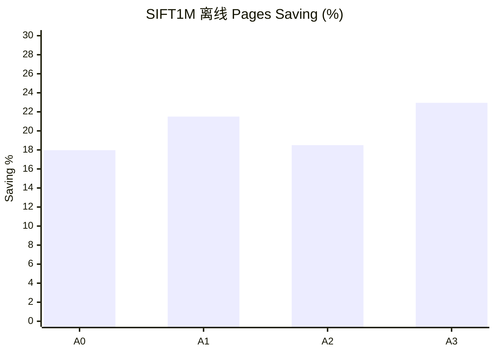
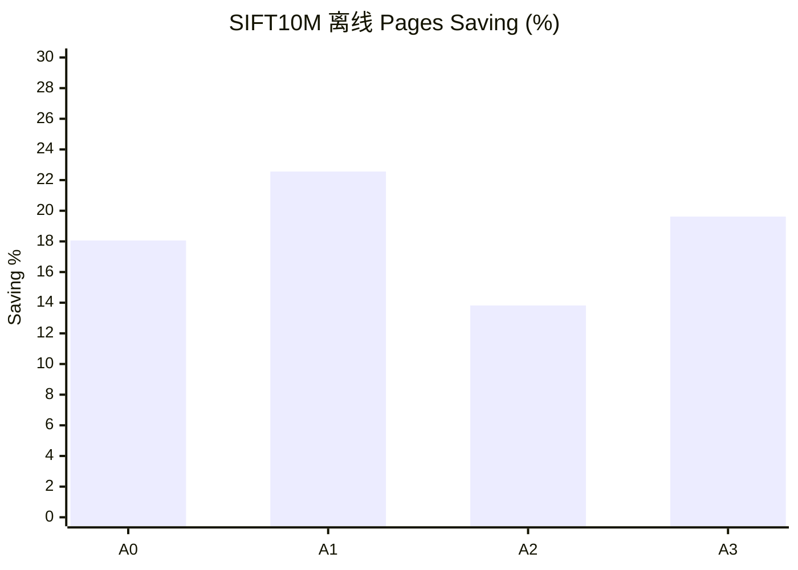
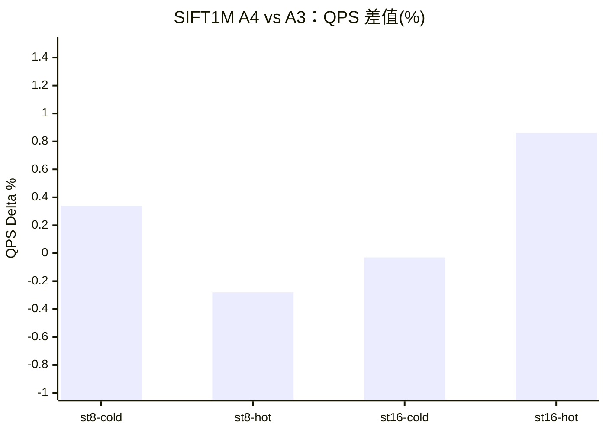
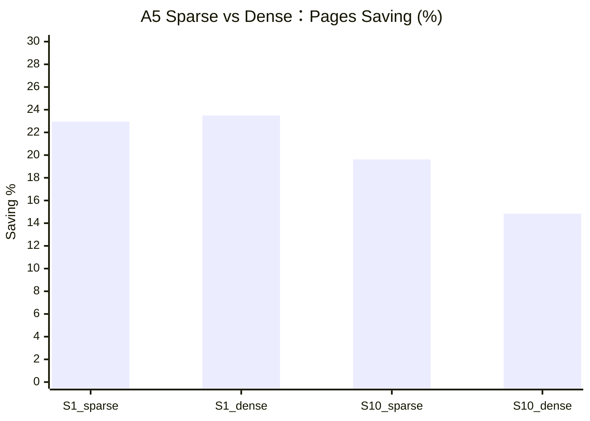

# SPANN Learned Policy 预算粒度优化方案

日期：2026-05-05

## 1. 目标

当前 learned policy 的每查询 posting 预算粒度较粗，在线候选大致为：

```text
B ∈ {32, 40, 48, 64}
```

当前在线决策逻辑：

```text
if P(safe | B=32) >= threshold: B = 32
elif P(safe | B=40) >= threshold: B = 40
elif P(safe | B=48) >= threshold: B = 48
else: B = 64
```

当前结果：

| 数据集 | 当前 Pages Saving | Oracle Saving | Oracle 利用率 |
|---|---:|---:|---:|
| SIFT1M | 17.3% | 50.8% | 34.1% |
| SIFT10M | 18.2% | 42.2% | 43.1% |

优化目标：

```text
SIFT1M:  Pages Saving >= 24%~26%
SIFT10M: Pages Saving >= 23%~25%
Recall@10 下降 <= 0.002
低召回查询数量不增加
QPS 相比当前 learned 提升 >= 3%~5%
```

## 2. 假设

### H1：当前预算粒度过粗

当前只能选 `32/40/48/64`，大量查询回退到 `64`，说明模型对 `48` 的安全性判断不够有信心。

当前在线分布：

| 数据集 | B<=32 | B<=40 | B<=48 | 回退到约 64 |
|---|---:|---:|---:|---:|
| SIFT1M | 21.3% | 12.6% | 15.1% | 51.1% |
| SIFT10M | 21.8% | 11.2% | 21.0% | 46.0% |

Oracle 显示真正需要 `B=64` 的查询远少于当前回退比例：

| 数据集 | Oracle B=64 |
|---|---:|
| SIFT1M | 11.2% |
| SIFT10M | 18.2% |

推论：增加中间预算（尤其 `B=56`）应能减少不必要回退。

### H2：`B=56` 是低风险改进点

`56` 与 `64` 距离近，误判代价显著低于 `32/40/48`，可吸收当前回退到 `64` 的不确定查询，在较小召回代价下增加 saving。

### H3：超低预算（16/24）有潜力，但必须更强保护

Oracle 显示一批简单查询可用更小预算，尤其 SIFT1M。引入 `16/24` 可进一步逼近 Oracle，但误判代价高，必须采用更保守阈值或额外防护特征。

### H4：分预算阈值优于单全局阈值

不同预算误判代价不同：

```text
错用 B=32：高召回风险
错用 B=48/56：风险相对更低
```

因此应对小预算使用更严格阈值，对大预算使用更宽松阈值。

## 3. 成功标准

### 3.1 主要成功标准

```text
Recall@10 下降 <= 0.002
低召回查询数量不增加
Pages Saving 比当前 learned 至少再提升 5 个百分点
QPS 比当前 learned 提升 >= 3%
```

### 3.2 强成功标准

```text
SIFT1M Pages Saving >= 26%
SIFT10M Pages Saving >= 25%
QPS 提升 >= 5%
Recall@10 下降 <= 0.0015
P99 延迟增幅 <= 3%
```

### 3.3 Oracle 利用率标准

```text
SIFT1M 达到 Oracle Saving 的 >= 50%
SIFT10M 达到 Oracle Saving 的 >= 55%
```

换算阈值：

```text
SIFT1M: 50.8% * 0.50 = 25.4%
SIFT10M: 42.2% * 0.55 = 23.2%
```

## 4. 独立失败信号

这些信号不是“没达到成功标准”的简单反面，而是独立风险。

### F1：预算塌缩

例如 `B=32` 占比 > 45%，策略退化为全局降预算，不再是 query-aware。

### F2：尾部召回退化

平均召回尚可，但难查询恶化：

```text
recall < 0.7 的查询数增加
recall < 0.5 的查询数增加
```

### F3：难查询被低配

Oracle 需要 `B=64` 的查询被频繁分配到 `B<=48`。

### F4：离线-在线不一致

离线显示高 saving/低风险，在线却没有对应 pages/QPS 改善。

### F5：QPS 与 pages 解耦

pages 降了但 QPS 不升反降，可能被模型开销、分支、调度、缓存行为抵消。

### F6：校准失真

模型给出高置信（如 `P(safe)>=0.95`）时实际安全率明显低于 95%。

### F7：数据集特异过拟合

SIFT1M 有效但 SIFT10M 退化（或反之）。

### F8：阈值不稳定

阈值微调 `0.01` 就引起预算分布大跳变。

### F9：`B=56` 空转

`B=56` 分配占比高，但 pages/QPS 改善很小，复杂度上升却无收益。

## 5. 消融计划

### A0：当前 learned 基线

```text
预算：{32,40,48,64}
单阈值
SIFT1M: threshold=0.95
SIFT10M: threshold=0.85
```

预期：SIFT1M saving 约 17.3%，SIFT10M saving 约 18.2%。

### A1：仅增加 B=56

```text
预算：{32,40,48,56,64}
单阈值
新增 risk_model_b56
```

预期：saving 增加 2~4 个百分点，回退 `64` 比例下降。

### A2：不加新预算，仅做分预算阈值

```text
预算：{32,40,48,64}
阈值：分预算
```

建议初值：

```text
SIFT1M: t32=0.98, t40=0.96, t48=0.92
SIFT10M: t32=0.95, t40=0.90, t48=0.85
```

### A3：B=56 + 分预算阈值

```text
预算：{32,40,48,56,64}
阈值：分预算
```

建议初值：

```text
SIFT1M: t32=0.98, t40=0.96, t48=0.93, t56=0.88
SIFT10M: t32=0.95, t40=0.92, t48=0.88, t56=0.82
```

### A4：增加超低预算

```text
预算：{16,24,32,40,48,56,64}
阈值：分预算且更保守
新增 risk_model_b16 / risk_model_b24
```

### A5：Sparse vs Dense

```text
Sparse: {32,40,48,56,64}
Dense:  {16,24,32,40,48,56,64}
```

### A6：单模型替代（多分类/回归）

```text
多分类：直接预测 min_B 类别
回归：预测连续预算再映射到离散预算
```

### A7：Page-aware 策略研究

核心假设：posting 数不等于真实 I/O 代价，page/read bytes 才是关键成本。

## 6. 推荐执行顺序

### Step 1：离线回放

先不改 C++，完成：

```text
训练 risk_model_b56
分预算阈值 sweep
离线比较 A0/A1/A2/A3
输出分布、saving、miss、校准
```

### Step 2：在线 A3

实现并验证：

```text
预算 {32,40,48,56}
分预算阈值
SIFT1M/SIFT10M: st=8, nt=16, ir=64
每次测试前清缓存
```

### Step 3：A3 通过后再做在线 A4

```text
增加 B=16/B=24
采用强保守阈值
```

### Step 4：page-aware 离线研究

仅在 A3/A4 与 Oracle 仍有明显差距时推进。

## 7. 首推实现路径

首选 A3：

```text
预算：{32,40,48,56,64}
分预算阈值
```

这是最低风险路径，因为 `B=56` 在 `64` 之前提供了温和缓冲。

## 8. 执行状态（2026-05-05）

执行顺序按计划进行：

1. Step 1 离线回放
2. Step 2 在线 A3（严格缓存）

### 8.1 产物

离线：

- `results/adaptive_budget/budget_granularity_plan_20260505/offline_ablation_summary.csv`
- `results/adaptive_budget/budget_granularity_plan_20260505/offline_ablation_summary.md`
- `results/adaptive_budget/budget_granularity_plan_20260505/sift1m_meta.json`
- `results/adaptive_budget/budget_granularity_plan_20260505/sift10m_meta.json`

在线：

- `results/adaptive_budget/budget_granularity_plan_20260505/online/sift1m_A0.csv`
- `results/adaptive_budget/budget_granularity_plan_20260505/online/sift1m_A3.csv`
- `results/adaptive_budget/budget_granularity_plan_20260505/online/sift10m_A0.csv`
- `results/adaptive_budget/budget_granularity_plan_20260505/online/sift10m_A3.csv`
- `results/adaptive_budget/budget_granularity_plan_20260505/online_summary.csv`
- `results/adaptive_budget/budget_granularity_plan_20260505/online_delta_vs_a0.csv`
- `results/adaptive_budget/budget_granularity_plan_20260505/execution_report.md`

补齐输入：

- `results/adaptive_budget/sift1m_ir64_retrain/budget_56.csv`
- `results/adaptive_budget/sift10m_ir64_retrain/budget_56.csv`

### 8.2 离线 A0/A1/A2/A3 结果快照（test split）

SIFT1M：

- A0 saving: `17.97%`
- A1 saving: `21.50%`
- A2 saving: `18.50%`
- A3 saving: `22.95%`
- A3 recall delta vs B64: `-0.00670`
- A3 miss: `5.90%`
- A3 oracle 利用率: `44.29%`

SIFT10M：

- A0 saving: `18.06%`
- A1 saving: `22.56%`
- A2 saving: `13.82%`
- A3 saving: `19.62%`
- A3 recall delta vs B64: `-0.01025`
- A3 miss: `9.60%`
- A3 oracle 利用率: `45.21%`

解释：

- `B=56` 能显著降低回退 `64`。
- 当前分预算阈值在 SIFT10M（以及部分 SIFT1M）偏激进，带来可观召回回退。

### 8.3 在线 A0 vs A3（严格缓存，st=8 nt=16 ir=64）

SIFT1M：

- A0 QPS: `7057`
- A3 QPS: `7474`（`+5.9%`）
- A0 recall@10: `0.97749`
- A3 recall@10: `0.97630`（delta `-0.00119`）
- pages/query：A3 相对 A0 下降 `5.93%`

SIFT10M：

- A0 QPS: `6636`
- A3 QPS: `6752`（`+1.8%`）
- A0 recall@10: `0.947214`
- A3 recall@10: `0.946483`（delta `-0.000730`）
- pages/query：A3 相对 A0 下降 `1.64%`

### 8.4 目标达成检查

- `Recall@10 delta <= 0.002`：在线 A3 对 A0 双数据集通过。
- `Pages Saving 比当前 learned +5pp`：SIFT1M 接近通过（`+4.98pp`），SIFT10M 未通过（`+1.56pp`）。
- `QPS +>=3%`：SIFT1M 通过（`+5.9%`），SIFT10M 未通过（`+1.8%`）。
- `低召回查询不增加`：SIFT10M 未完全满足。

结论：

- A3 在 SIFT1M 路径有效。
- SIFT10M 需继续阈值再标定。

## 9. A4 受控离线预演（仅 SIFT1M）

执行内容：

- 流量：`test split`（`2000` queries）
- 补齐：`budget_24.csv`
- 训练：`B={16,24,32,40,48,56}`
- 输出目录：`results/adaptive_budget/budget_granularity_plan_20260505/a4_preview_sift1m`

训练集 safe rate：

- `B16: 43.5%`
- `B24: 59.8%`
- `B32: 72.2%`
- `B40: 81.6%`
- `B48: 88.9%`
- `B56: 95.1%`

策略阈值：

- `A4_cons_v1`: `t16=0.998, t24=0.995, t32=0.985, t40=0.970, t48=0.945, t56=0.900`
- `A4_cons_v2`: `t16=0.997, t24=0.993, t32=0.982, t40=0.965, t48=0.938, t56=0.895`
- `A4_cons_v3`: `t16=0.996, t24=0.990, t32=0.980, t40=0.960, t48=0.930, t56=0.890`

结果（相对 B64）：

- `A3_ref`: saving `22.95%`, recall delta `-0.00670`, miss `5.90%`
- `A4_cons_v1`: saving `21.68%`, recall delta `-0.00595`, miss `5.30%`
- `A4_cons_v2`: saving `22.59%`, recall delta `-0.00630`, miss `5.55%`
- `A4_cons_v3`: saving `23.49%`, recall delta `-0.00660`, miss `5.80%`

观察：

- `B16/B24` 已被小比例启用（约 `3.6%~6.0%`），未出现集中失误。
- `low_recall<0.7` 与 `A3_ref` 持平。
- 该预演中 `B16/B24` 导致 miss 的计数为 0。

## 10. SIFT1M 在线继续验证（A4）

在线严格缓存测试：

- `A3_ref`
- `A4_cons_v1`
- `A4_cons_v2`
- `A4_cons_v3`

输出目录：`results/adaptive_budget/budget_granularity_plan_20260505/online_sift1m_a4`

单次结果：

- `A3_ref`: QPS `7485`, Recall@10 `0.976300`
- `A4_cons_v1`: QPS `7326`, Recall@10 `0.976720`
- `A4_cons_v2`: QPS `7358`, Recall@10 `0.976540`
- `A4_cons_v3`: QPS `7468`, Recall@10 `0.976380`

解释：

- `A4_cons_v1/v2` 虽有少量召回改善，但 QPS 明显下降。
- `A4_cons_v3` 与 A3 在 QPS 接近，召回略好。

5 次交替复现（A3 vs A4_v3）：

- QPS：`+0.12%`
- Recall@10：`+0.000088`
- pages/query：`-0.49%`
- postings/query：`-0.78%`
- `low<0.7`、`low<0.5`：无变化

结论：

- `A4_cons_v3` 是 SIFT1M 中最优 A4 候选。
- 但属于小幅增益，不是跃迁式提升。

## 11. SIFT1M 收口验证（st=8/16，冷/热缓存）

扩展验证：

- `st=8,16`
- `cold/hot`
- 每条件 5 次重复
- 对比 `A3_ref` vs `A4_cons_v3`

输出：

- `results/adaptive_budget/budget_granularity_plan_20260505/online_sift1m_finalize/finalize_report.md`
- `results/adaptive_budget/budget_granularity_plan_20260505/online_sift1m_finalize/delta_a4_vs_a3_by_condition.csv`

条件差值（A4 - A3）：

- `st=8,cold`：QPS `+0.34%`，Recall `+0.000078`，pages/query `-0.82%`
- `st=8,hot`：QPS `-0.28%`，Recall `+0.000080`，pages/query `-0.71%`
- `st=16,cold`：QPS `-0.03%`，Recall `+0.000104`，pages/query `+0.14%`（略差）
- `st=16,hot`：QPS `+0.86%`，Recall `+0.000080`，pages/query `-0.62%`

尾部鲁棒性：

- `low recall <0.7`：全条件不变
- `low recall <0.5`：全条件不变

SIFT1M 决策：

- `A4_cons_v3` 安全、基本无召回尾部退化。
- 收益小且受条件影响。
- 默认可保守用 `A3_ref`，也可探索性启用 `A4_cons_v3` 并保留回滚。

## 12. 剩余任务执行（A5/A6/A7）

已完成双数据集离线执行。

输出：

- `results/adaptive_budget/budget_granularity_plan_20260505/remaining_ablation/remaining_ablation_summary.csv`
- `results/adaptive_budget/budget_granularity_plan_20260505/remaining_ablation/remaining_ablation_report.md`

### 12.1 A5（Sparse vs Dense）

SIFT1M：

- `A5_sparse`: saving `22.95%`, recall delta `-0.00670`
- `A5_dense`: saving `23.49%`, recall delta `-0.00660`

SIFT10M：

- `A5_sparse`: saving `19.62%`, recall delta `-0.01025`
- `A5_dense`: saving `14.84%`, recall delta `-0.00625`

解读：

- SIFT1M 上 Dense 略优。
- SIFT10M 上 Dense 为了安全牺牲了不少 saving。

### 12.2 A6（多分类/回归）

两数据集都出现“saving 很高但召回和尾部明显恶化”：

- SIFT1M `A6_multiclass`: saving `63.66%`, recall delta `-0.06415`, miss `41.65%`
- SIFT10M `A6_multiclass`: saving `50.23%`, recall delta `-0.06180`, miss `40.90%`

结论：

- A6 在当前约束下不适合作为生产路径。

### 12.3 A7（page-aware 离线研究）

执行：

- `A7_oracle_posting`
- `A7_oracle_page`

结果：

- 在当前离散预算网格下，两者结果相同。

解读：

- 当前预算离散度和 pages 单调性导致 page-aware 与 posting-aware 的 oracle 选择等价。
- 若要看到 page-aware 优势，需要更细粒度在线控制。

### 12.4 完成矩阵

已完成：

- Step 1：离线回放（A0/A1/A2/A3）
- Step 2：在线 A3（严格缓存）
- Step 3：SIFT1M 在线 A4（含重复验证）
- A5：Sparse vs Dense
- A6：Multiclass/Regression
- A7：Page-aware oracle 离线研究

条件性未扩展：

- 未推进 SIFT10M 的 A4 全量在线，因为在严格召回约束下 A3/A4 的 recall-QPS trade-off 仍偏紧。

## 13. A4 运维交接

已增加运行与回滚工件：

- 运行脚本：`scripts/run_sift1m_profile.sh`
- 配置文件：
  - `configs/sift1m_ir64_a3_ref_rollback.ini`
  - `configs/sift1m_ir64_a4_cons_v3.ini`
- 阶段门禁：
  - `results/adaptive_budget/budget_granularity_plan_20260505/online_sift1m_finalize/A4_STAGE_GATE.md`

当前门禁结论：

- 默认保留 `A3_ref`
- `A4_cons_v3` 作为可选策略，且已有回滚路径

## 14. 结果图表

本节把关键结果图表直接保存到方案文档中。

### 14.1 离线 A0/A1/A2/A3（Pages Saving %）

| 数据集 | A0 | A1 | A2 | A3 |
|---|---:|---:|---:|---:|
| SIFT1M | 17.97 | 21.50 | 18.50 | 22.95 |
| SIFT10M | 18.06 | 22.56 | 13.82 | 19.62 |





### 14.2 SIFT1M A4 vs A3（在线收口，差值）

| st | cache | QPS Δ% | Recall Δ | Pages Δ%（A4 更好为 +） |
|---:|---|---:|---:|---:|
| 8 | cold | +0.34 | +0.000078 | +0.82 |
| 8 | hot | -0.28 | +0.000080 | +0.71 |
| 16 | cold | -0.03 | +0.000104 | -0.14 |
| 16 | hot | +0.86 | +0.000080 | +0.62 |



### 14.3 剩余消融（A5/A6/A7）快照

| 数据集 | 策略 | Pages Saving % | Recall Delta vs B64 | Miss % |
|---|---|---:|---:|---:|
| SIFT1M | A5_sparse | 22.95 | -0.00670 | 5.90 |
| SIFT1M | A5_dense | 23.49 | -0.00660 | 5.80 |
| SIFT1M | A6_multiclass | 63.66 | -0.06415 | 41.65 |
| SIFT1M | A6_regression | 54.47 | -0.03715 | 28.65 |
| SIFT1M | A7_oracle_posting | 53.98 | 0.00000 | 0.00 |
| SIFT10M | A5_sparse | 19.62 | -0.01025 | 9.60 |
| SIFT10M | A5_dense | 14.84 | -0.00625 | 6.05 |
| SIFT10M | A6_multiclass | 50.23 | -0.06180 | 40.90 |
| SIFT10M | A6_regression | 45.85 | -0.04425 | 34.70 |
| SIFT10M | A7_oracle_posting | 45.21 | 0.00000 | 0.00 |


